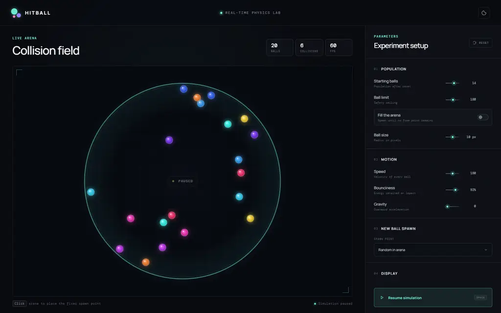

# Hitball

A real-time browser simulation in which balls bounce inside a circular arena. Every new ball-to-ball collision creates another ball, turning a small initial population into an increasingly dense collision field.



## Features

- Real-time ball-to-ball and ball-to-arena collision physics
- Collision-driven population growth
- Four configurable spawn strategies
- Adjustable speed, radius, bounciness, gravity, starting population, and ball limit
- Automatic **Fill the arena** mode without a fixed population ceiling
- Motion trails, live FPS, collision, and population counters
- Pause, resume, reset, fixed-point placement, and high-contrast controls
- Responsive desktop and mobile interface
- Spatial collision broad phase and cached ball sprites for dense simulations

## Spawn strategies

Every new contact between two balls triggers one spawn event. Persistent overlap does not repeatedly create balls.

| Strategy | Behavior |
| --- | --- |
| **At collision** | Creates the ball at the collision position. |
| **Random in arena** | Selects a random vacant position that does not overlap any existing or same-frame pending ball. |
| **Fixed point** | Creates the ball at a user-defined point. Click anywhere inside the arena to move that point. |
| **Offset from collision** | Applies a configurable distance and direction to the collision position. |

When **Fill the arena** is active, occupied fixed, impact, and offset positions fall back to a vacant random position. Spawning stops once no valid position remains.

## Controls

### Population

| Control | Description |
| --- | --- |
| Starting balls | Population created after a reset. |
| Ball limit | Fixed safety ceiling for the simulation. |
| Fill the arena | Disables the fixed ceiling and spawns until no vacant point remains. |
| Ball size | Radius shared by all balls. |

### Motion

| Control | Description |
| --- | --- |
| Speed | Changes the velocity of existing and newly created balls. |
| Bounciness | Controls the restitution applied during ball and boundary impacts. |
| Gravity | Adds downward acceleration. |

### Spawn configuration

Fixed spawning exposes horizontal and vertical position controls. Offset spawning exposes distance and direction controls. Selecting a different strategy shows only its relevant settings.

### Interaction

- Click the arena to select and move the fixed spawn point.
- Press <kbd>Space</kbd> to pause or resume.
- Use **Reset** to restore the configured starting population and clear the collision counter.
- Enable **Motion trails** to retain a fading trace of each path.
- Use the moon button to toggle the high-contrast appearance.

## Physics and performance

The simulation uses equal-mass impulse resolution with configurable restitution. Boundary collisions are resolved against the circular arena normal. Fast-moving balls are processed with adaptive substeps to reduce tunneling.

A uniform spatial grid limits collision checks to nearby balls instead of comparing every possible pair. Reusable typed-array grid storage, numeric contact identifiers, throttled status updates, and cached canvas sprites reduce per-frame work and allocation pressure. Newly created balls receive a short collision grace period so spawning at an impact point does not immediately create an artificial collision cascade.

## Getting started

### Requirements

- Node.js 20.19+ or 22.12+
- npm

### Install and run

```bash
npm install
npm run dev
```

Vite prints the local development URL after startup.

### Production build

```bash
npm run build
npm run preview
```

The production bundle is written to `dist/`.

## Scripts

| Command | Purpose |
| --- | --- |
| `npm run dev` | Start the Vite development server. |
| `npm run build` | Type-check the application and create a production bundle. |
| `npm run preview` | Serve the production bundle locally. |

## Project structure

```text
.
├── docs/
│   └── hitball-simulation.webp
├── src/
│   ├── main.ts        # UI, simulation loop, collision physics, and controls
│   └── style.css      # Responsive application styling
├── index.html         # Browser entry point
├── package.json       # Scripts and development dependencies
└── tsconfig.json      # Strict TypeScript configuration
```

## Technology

- TypeScript
- Canvas 2D
- Vite
- CSS Grid and responsive CSS
